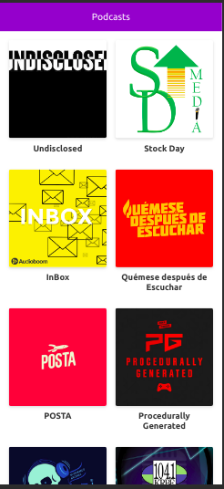

# Podcast App

Podcast app integrated with Audioboom API

## How works?

Require Node.JS 10

* `npm install` to install dependencies.
* `npm run dev` to dev environment.
* `npm run build && npm start` to production environment.

## Licencia

MIT
